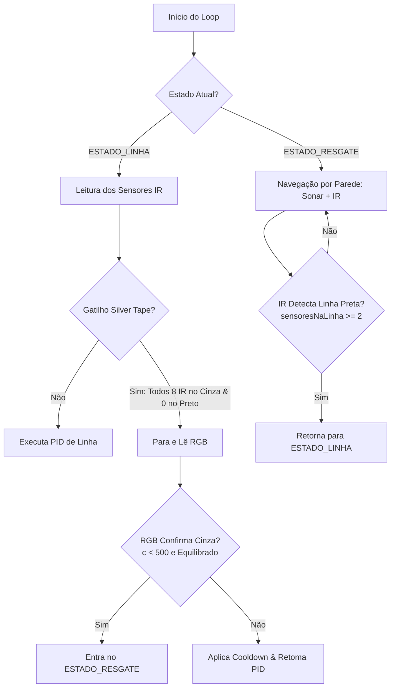

# Análise de Código e Proposta de Melhorias - Seguidor de Linha

Este documento analisa as interações entre a leitura da silver tape (fita cinza de resgate) e a programação de seguimento de linha (PID) no robô, identificando conflitos e propondo melhorias arquiteturais.

---

## 1. Problemas Identificados no Código Atual

### A. Gatilho do Sensor RGB Muito Frequente e Sem Cooldown Adequado
* **O que ocorre:** O robô constantemente tenta validar a presença da silver tape no meio da pista se os sensores IR detectarem qualquer valor intermediário (por exemplo, sombras ou poeira).
* **Impacto:** Leituras frequentes via I2C (`getRawData` do TCS34725) são lentas e bloqueiam a CPU por alguns milissegundos. Isso reduz drasticamente a frequência de atualização do PID, causando perda de precisão em curvas rápidas e oscilações indesejadas.

### B. Critério IR para Silver Tape Muito Permissivo
* **O que ocorre:** O gatilho atual no arquivo `robo_linha.ino` exige apenas `sensoresNoPreto == 0 && sensoresNoCinza >= 5`.
* **Impacto:** Durante curvas fechadas ou quando o robô desalinha ligeiramente da linha preta, é comum que nenhum sensor leia o preto absoluto (`>650`) e que alguns sensores leiam valores na faixa de transição do cinza (`150~650`). Isso causa falsos positivos que param o robô desnecessariamente para ler o RGB.

### C. Leitura do Sensor RGB na Zona de Resgate (ESTADO_RESGATE)
* **O que ocorre:** No final da zona de resgate, o robô tenta ler os sensores RGB para validar se a linha preta encontrada é de fato a saída da arena.
* **Impacto:** O sensor RGB continua ativo no resgate, contrariando a premissa de que a navegação do resgate deve ser guiada estritamente pelos sensores ultrassônicos e infravermelhos. Além disso, a leitura do RGB pode falhar sob condições de luz ruins da arena.

### D. Janela de Luminosidade do Cinza Muito Alta
* **O que ocorre:** O teto de luminosidade para o cinza está configurado para `520` no arquivo `sensores.h`.
* **Impacto:** Placas brancas com reflexividade ligeiramente menor ou sob sombras podem cair na faixa de `500~520`, sendo falsamente identificadas como cinza.

---

## 2. Proposta de Melhorias Implementáveis

### 1. Refinamento do Gatilho IR da Silver Tape
* **Nova Regra:** O gatilho de detecção da silver tape deve ser extremamente específico.
  * **Critério 1:** `sensoresNoPreto == 0`. Absolutamente nenhum sensor pode estar lendo preto.
  * **Critério 2:** `sensoresNoCinza >= 7` (ou idealmente `8`). A fita cinza atravessa a pista inteira de forma transversal, o que significa que a barra inteira (ou quase toda ela) deve ler cinza.
  * **Fórmula:** Só realizaremos a parada e a validação por RGB se os 8 sensores IR estiverem lendo cinza e nenhum estiver no preto. Isso impede que o gatilho ocorra durante o percurso da pista preta.

### 2. Ajuste Fino dos Limiares RGB para a Silver Tape
* No arquivo [sensores.h](file:///c:/Users/51909778893/Desktop/robo/robo_seguidor_linha/robo_linha/sensores.h), ajustaremos a função `ehCinzaRGB`:
  * Alterar o teto do canal Clear (`c`) de `520` para `500`. Qualquer valor acima de `500` será sumariamente descartado como branco.
  * Adicionar uma checagem de equilíbrio de canais para garantir que a cor seja neutra (característica física da silver tape).

### 3. Remoção Completa do RGB na Zona de Resgate
* A validação de saída do resgate será feita **exclusivamente pelos sensores IR**.
* Quando o robô estiver navegando em `ESTADO_RESGATE` e detectar uma linha preta sólida (por exemplo, `sensoresNaLinha >= 2`), ele voltará imediatamente para o `ESTADO_LINHA`. Isso elimina a necessidade de fazer leituras RGB no resgate, economizando processamento e evitando falsos negativos.

### 4. Cooldown Pós-Descarte Mais Eficiente
* Aumentaremos o cooldown de bloqueio para novas leituras RGB após um falso positivo para `2000ms`, garantindo que o robô tenha tempo de se afastar totalmente do ponto de sombra ou reflexo que gerou o falso gatilho.
